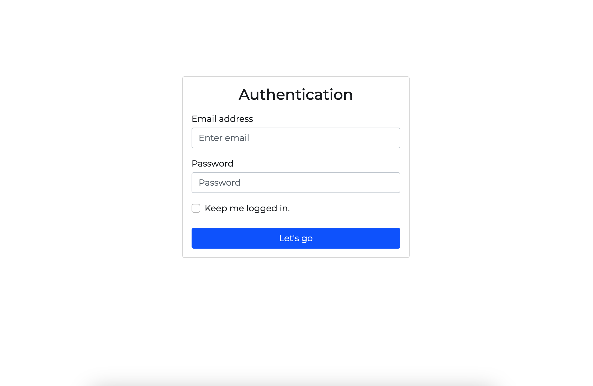
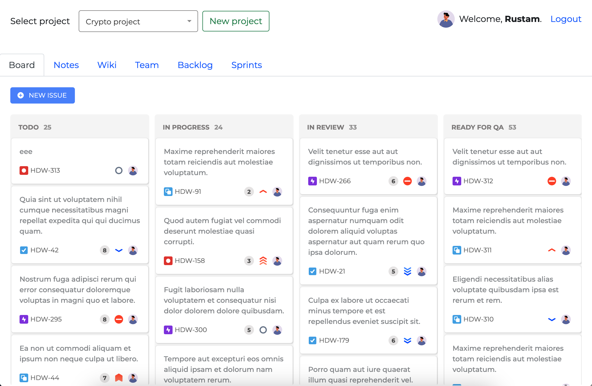
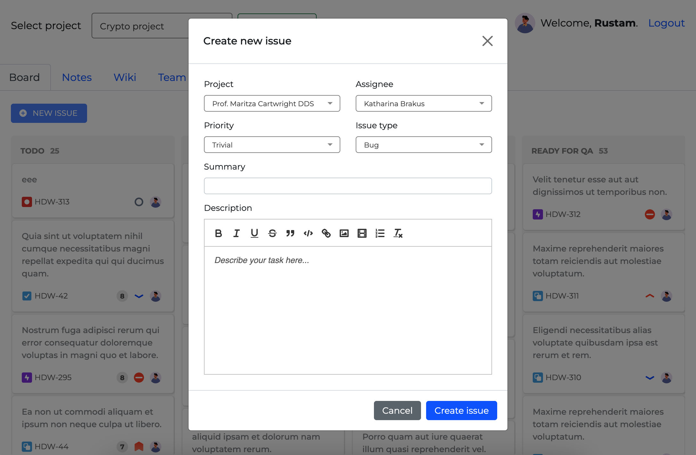

## Kanban board

Used nwidart/modules with livewire and Bootstrap 5 for quick development.

2 days of development for closing main back and front-end functionality.

dragula.js for kanban, lazyload on columns for large kanban data.

context-menu.js for context menu, quill.js for rich editor.

select2.js for future big data so that it is possible to do ajax loading and searching.

## Laravel 

Used migrations, seeders, factories. Good DB architecture - see below overview section. Structure prepared for future functionality like sprints, projects, etc.

## Overview

### Auth page

### Kanban board page

### New issue

## DB Structure

## API.

The API functionality was not implemented, but if such a need had arisen, my default flow would have been used:

Request -> DTO -> Controller -> Service / UseCase / Action -> Presenter -> Data.

The data will be returned in the response in the controller.
