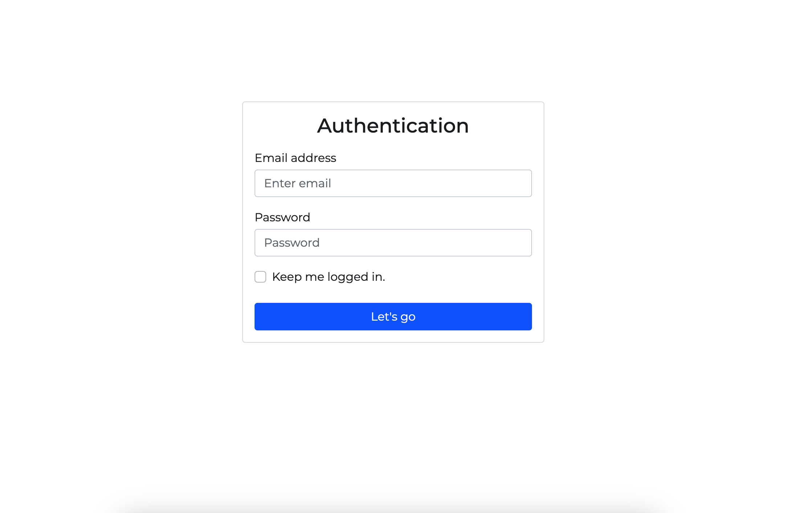
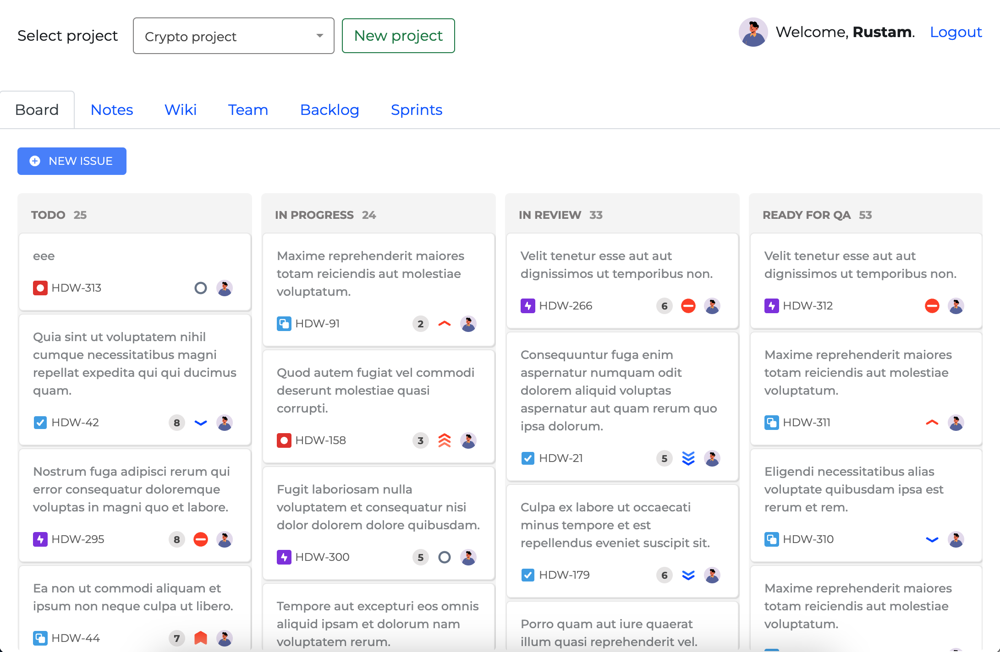
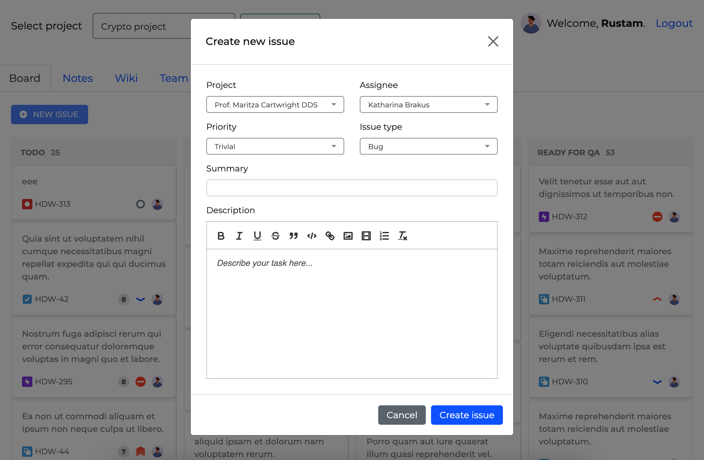
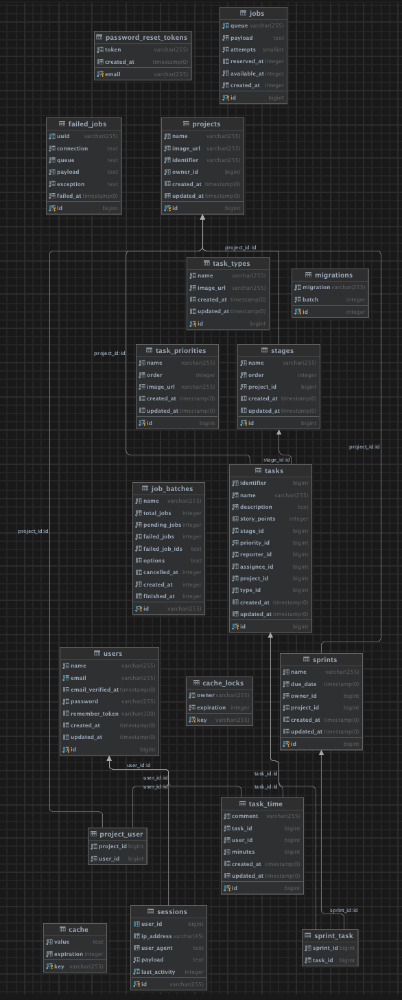

## Kanban board

> [!NOTE]  
> 2 days of development for closing main back and front-end functionality.
> 1 day for refactoring code and implementing tests.

## Technologies
- Used `nwidart/modules` with `livewire` and `Bootstrap 5` for quick development.
- `dragula.js` for kanban, `lazyload` on columns for large kanban data.
- `context-menu.js` for context menu, `quill.js` for rich editor.
- `select2.js` for future big data so that it is possible to do ajax loading and searching.

## Setup
- `composer install`
- `cp .env.example .env`
- `php artisan key:generate`
- `php artisan migrate`
- `php artisan db:seed`
- `php artisan serve`
- http://localhost:8000
- creds: `admin@admin.com`, `password`

## Overview

### Auth page

### Kanban board page

### New issue

## DB Structure

